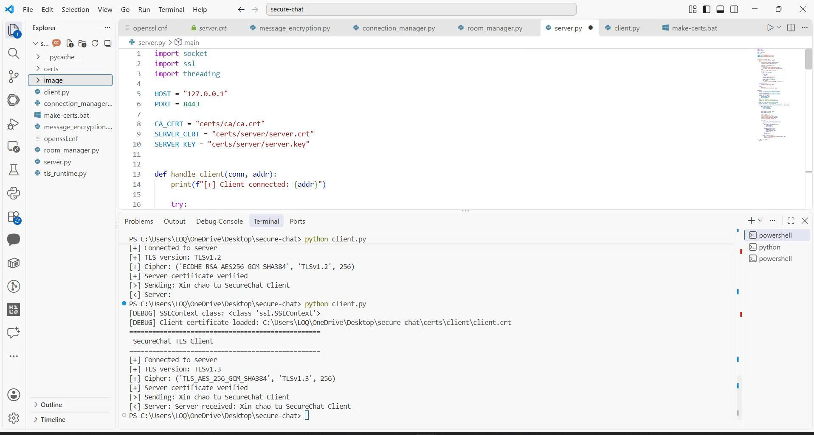
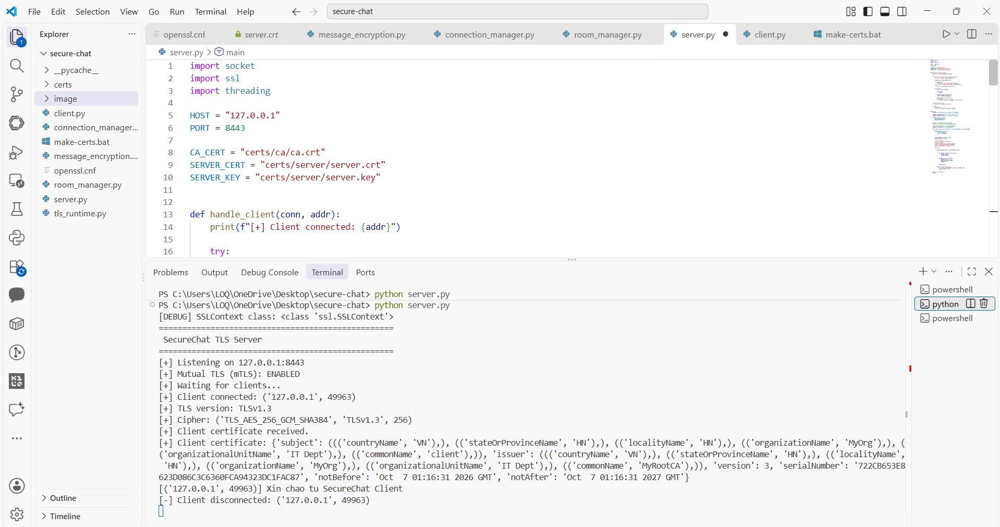
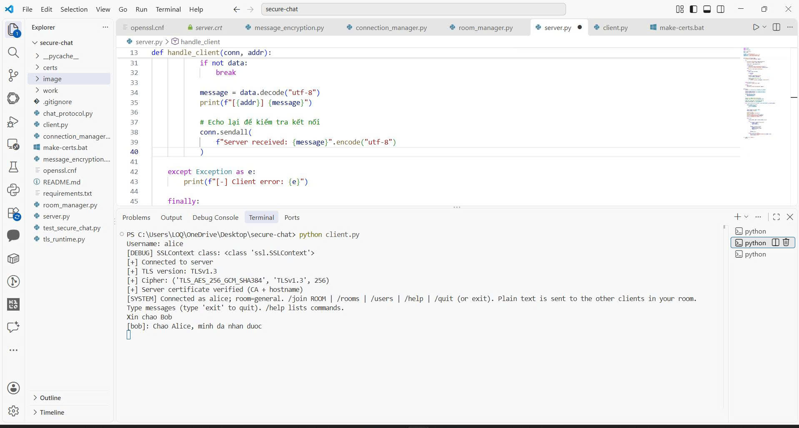
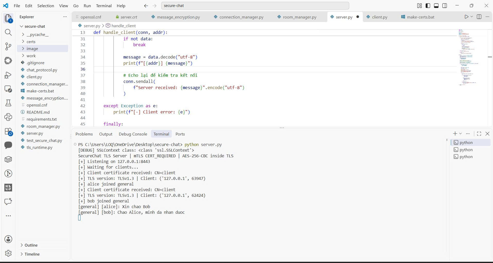
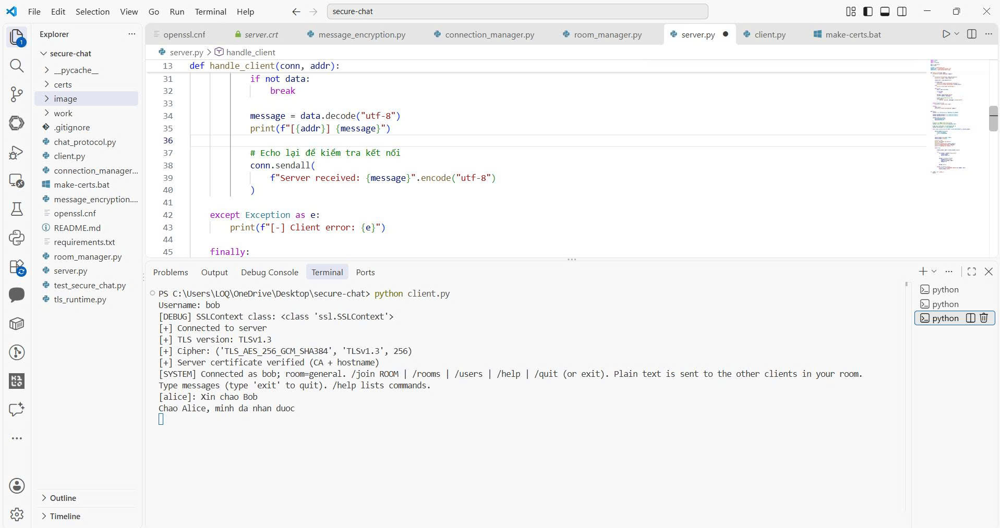

# Ảnh thực hành LAB01

Năm ảnh gốc do sinh viên cung cấp, đã xem trực tiếp; giữ nguyên tên và nội dung.
Ảnh có đường dẫn secure-chat vì được chụp trước khi chuyển bản làm việc sang LAB01.

## 1. Client kiểm tra echo qua TLS 1.3

Phần cuối ảnh có ssl.SSLContext chuẩn và chuỗi Server received. Phần đầu còn lịch sử lỗi cũ.

## 2. Server nhận chứng chỉ client

Có Client certificate received và thông tin CN=client, CA=MyRootCA.

## 3. Alice nhận tin từ Bob

Alice gửi Xin chao Bob và nhận [bob]: Chao Alice, minh da nhan duoc.

## 4. Server ghi nhận hai client chat

Alice và Bob cùng vào general; server ghi nhận hai chiều nhắn tin.

## 5. Bob nhận tin từ Alice

Bob nhận [alice]: Xin chao Bob rồi gửi câu trả lời.

