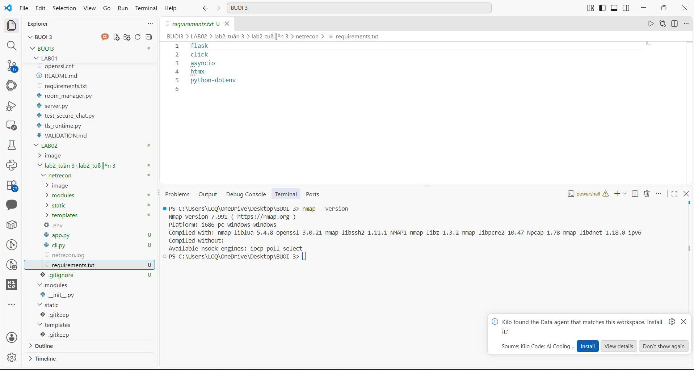
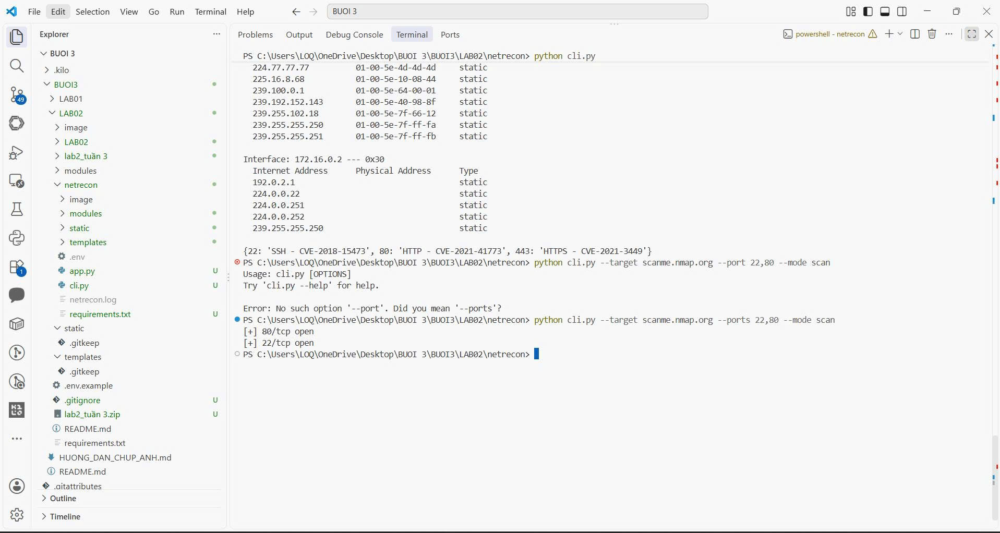
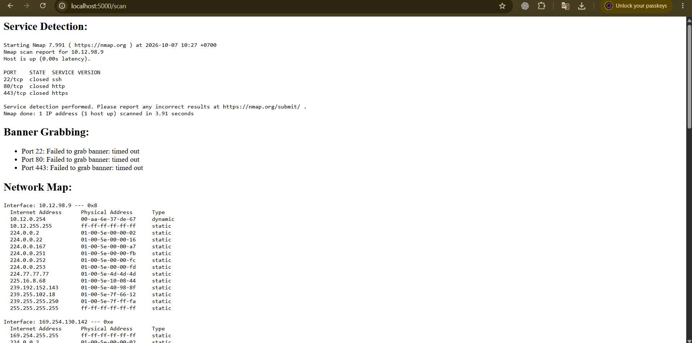
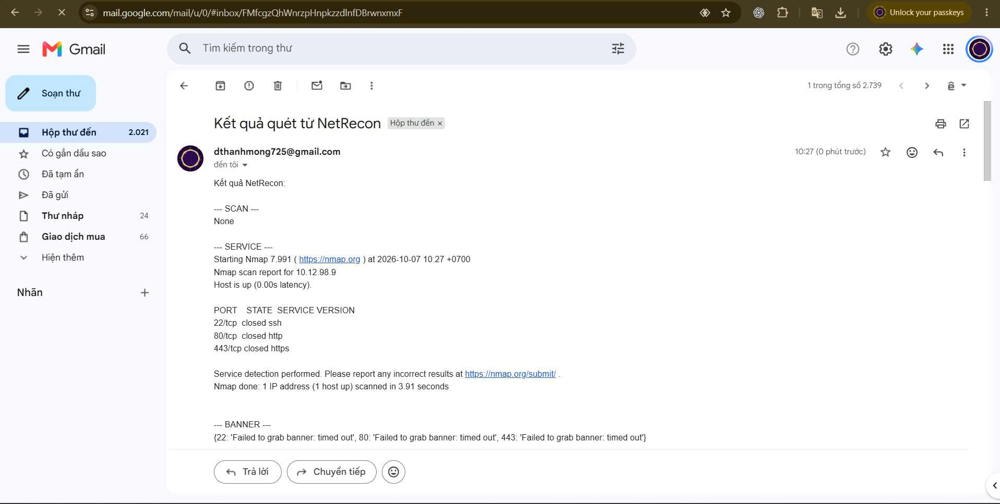

# LAB02 - NetRecon

Bài thực hành NetRecon thuộc Buổi 3, tương ứng mục 3.4 của giáo trình Lab 03.

**Trạng thái:** đã triển khai và thực hành CLI, giao diện web, gửi kết quả qua email.
Thư mục [image](image/README.md) có 10 ảnh gốc ghi lại các bước thực hiện ngày 07/10/2026.
README này đối chiếu mã nguồn và ảnh đã có; không coi các kết quả closed/timeout là quét lỗi
hoặc xác nhận lỗ hổng khi chưa có bằng chứng.

## 1. Nội dung bài thực hành

NetRecon kết hợp các chức năng sau:

| Thành phần | Chức năng trong mã nguồn hiện tại |
|---|---|
| PortScanner | Quét kết nối TCP bằng asyncio, giới hạn số kết nối đồng thời |
| ServiceDetector | Gọi Nmap với tùy chọn -sV để nhận dạng dịch vụ |
| BannerGrabber | Kết nối tới cổng và đọc tối đa 1024 byte banner |
| NetworkMapper | Đọc bảng ARP của máy bằng lệnh arp -a |
| VulnChecker | Tra bảng CVE minh họa theo số cổng |
| FilterUtils | Hàm lọc địa chỉ theo whitelist/blacklist |
| CLI | Chọn target, ports, mode và mức đồng thời |
| Flask Web | Nhập thông số, thực hiện quét và hiển thị kết quả |
| EmailSender | Gửi kết quả từ luồng web qua Gmail SMTP SSL |
| Logging | Ghi một số hoạt động và kết quả vào netrecon.log, có thời gian |

## 2. Cấu trúc thư mục

~~~text
LAB02/
├── README.md
├── image/
│   ├── README.md
│   └── ảnh thực hành .jpg
└── netrecon/
    ├── app.py
    ├── cli.py
    ├── requirements.txt
    ├── .env                    # cấu hình tại máy, không đưa lên Git
    ├── netrecon.log             # phát sinh khi chạy
    ├── modules/
    │   ├── __init__.py
    │   ├── banner_grabber.py
    │   ├── email_sender.py
    │   ├── filter_utils.py
    │   ├── network_mapper.py
    │   ├── port_scanner.py
    │   ├── service_detector.py
    │   └── vuln_checker.py
    ├── static/
    │   └── style.css
    └── templates/
        ├── index.html
        ├── layout.html
        └── result.html
~~~

Code thực hành nằm trong **netrecon/**. Khi chạy chương trình, mở terminal tại thư mục này.
Các thư mục modules/static/templates và requirements.txt ở cấp LAB02 là phần chuẩn bị trước đó;
đường dẫn trong các lệnh bên dưới dùng bộ mã thực tế ở netrecon.

## 3. Chuẩn bị môi trường

Trong PowerShell:

~~~powershell
cd "C:\Users\LOQ\OneDrive\Desktop\BUOI 3\BUOI3\LAB02\netrecon"
nmap --version
python -m pip install -r requirements.txt
~~~

Ảnh thực hành ghi nhận Nmap **7.991** và thư viện Python đã được cài đặt.
Khi clone repository về vị trí khác, thay đường dẫn bằng thư mục LAB02/netrecon tương ứng.

### Cấu hình email tại máy

Tạo file .env trong netrecon và điền thông tin tài khoản của chính bạn:

~~~dotenv
SMTP_USER=YOUR_GMAIL_ADDRESS
SMTP_PASS=YOUR_APP_PASSWORD
~~~

Đây chỉ là tên biến và giá trị minh họa, không phải thông tin đăng nhập thật.
Module email_sender dùng python-dotenv để nạp cấu hình, kết nối smtp.gmail.com cổng 465
bằng SMTP_SSL, sau đó gửi nội dung kết quả.

**Ảnh cấu hình .env đã cung cấp có giá trị SMTP_PASS chưa che. Không nhúng ảnh đó
trong tài liệu này. Cần thu hồi mật khẩu ứng dụng đã lộ, tạo mật khẩu mới và thay ảnh
bằng bản đã che; chỉ sửa ảnh không vô hiệu hóa mật khẩu cũ.**

## 4. Chạy CLI

### Chế độ nhập target tương tác

~~~powershell
python cli.py
~~~

Chương trình hỏi Target IP. Các cổng mặc định là 22,80,443; mode mặc định là all.

### Chỉ quét cổng TCP

Ví dụ với dịch vụ thử nghiệm trên máy của bạn:

~~~powershell
python cli.py --target 127.0.0.1 --ports 8000 --mode scan
~~~

Khi có dịch vụ đang lắng nghe, terminal có thể hiển thị:

~~~text
[+] 8000/tcp open
~~~

Muốn tạo dịch vụ HTTP thử nghiệm, mở một terminal riêng trong thư mục demo không chứa
dữ liệu riêng tư rồi chạy:

~~~powershell
python -m http.server 8000 --bind 127.0.0.1
~~~

### Chạy các chức năng trong một lần

~~~powershell
python cli.py --target 127.0.0.1 --ports 8000 --mode all --rate-limit 20
~~~

Chỉ dùng mục tiêu bạn sở hữu hoặc được phép kiểm tra.
Các IP/domain trong ảnh là dữ liệu của lần thực hành đã chụp, không phải địa chỉ phải dùng lại.

| Tham số | Ý nghĩa |
|---|---|
| --target | Địa chỉ mục tiêu; nếu bỏ qua sẽ hỏi Target IP |
| --ports | Danh sách cổng phân cách bằng dấu phẩy, ví dụ 22,80,443 |
| --rate-limit | Số kết nối quét TCP đồng thời tối đa; mặc định 100 |
| --mode scan | Quét cổng TCP |
| --mode service | Nmap nhận dạng dịch vụ |
| --mode banner | Đọc banner |
| --mode map | In bảng ARP cục bộ |
| --mode vuln | Tra bảng CVE minh họa theo cổng |
| --mode all | Chạy các chức năng trên |

Dùng **--ports**, không dùng --port. Mặc dù dòng help có nhắc range, code hiện tại
chỉ tách danh sách bằng dấu phẩy, chưa xử lý cú pháp 1-100.

## 5. Chạy giao diện web và nhận email

Tại thư mục netrecon:

~~~powershell
python app.py
~~~

Mở trình duyệt tại http://localhost:5000/ rồi nhập:

1. **Target IP:** địa chỉ máy lab.
2. **Ports:** danh sách cổng, cách nhau bằng dấu phẩy.
3. **Mode:** All, Port Scan, Service Detection, Banner Grab, Network Map hoặc Vulnerability Check.
4. **Email nhận kết quả:** địa chỉ nhận email thử nghiệm.

Nhấn Scan. Ứng dụng thực hiện tác vụ, tạo nội dung kết quả và gọi hàm gửi email.
Trang kết quả hiển thị các phần có dữ liệu như Service Detection, Banner Grabbing,
Network Map và Vulnerability Check.

Trong Gmail, kiểm tra thư có tiêu đề:

~~~text
Kết quả quét từ NetRecon
~~~

Ảnh số 10 xác nhận hộp thư đã nhận được email của lần thực hành.
Đối với một lần chạy mới, kiểm tra cả terminal và hộp thư; trang kết quả web tự nó
không chứng minh SMTP đã gửi thành công. CLI hiện tại không gọi hàm gửi email.

File app.py đang dùng debug=True và lắng nghe 0.0.0.0:5000 theo bài mẫu;
dùng trong môi trường thực hành, không coi đây là cấu hình triển khai công khai.

## 6. Kết quả thực hành và ảnh minh chứng

| Nhóm | Kết quả quan sát trong ảnh | Ảnh |
|---|---|---|
| Môi trường | Nmap 7.991; requirements và cài dependency | 2, 4, 5 |
| CLI nhập target | Mục tiêu 10.12.98.9; 22/80/443 đều closed; banner timeout; có bảng ARP | 6 |
| CLI mode scan | Sau khi sửa --port thành --ports, kết quả 22/tcp và 80/tcp open | 7 |
| CLI mode all | Bộ quét TCP in 80/tcp open nhưng Nmap báo Host seems down; banner timeout; có ARP | 8 |
| Web | Trang localhost:5000/scan hiển thị Service Detection, Banner Grabbing và Network Map | 9 |
| Email | Gmail đã nhận thư Kết quả quét từ NetRecon, có nội dung kết quả | 10 |

Các trạng thái ở ảnh số 8 đến từ các bước kiểm tra khác nhau. Giữ nguyên các kết quả đó,
không gộp thành kết luận rằng toàn bộ dịch vụ trên mục tiêu đã được nhận dạng.

### Nmap và môi trường

### Quét cổng qua CLI

### Kết quả trên giao diện web

### Email nhận kết quả

Xem [toàn bộ chú thích và ảnh thực hành](image/README.md).
Thư mục có 10 ảnh gốc; 8 ảnh được nhúng trong gallery. Hai ảnh về tài khoản/cấu hình
chưa được nhúng do có dữ liệu nhạy cảm cần che trước khi công khai.

## 7. Các file và vai trò

| File | Vai trò |
|---|---|
| netrecon/cli.py | Giao diện dòng lệnh bằng Click |
| netrecon/app.py | Routes Flask, điều phối tác vụ và gửi email |
| netrecon/modules/port_scanner.py | Kết nối TCP bất đồng bộ, timeout và semaphore |
| netrecon/modules/service_detector.py | Gọi nmap -sV |
| netrecon/modules/banner_grabber.py | Kết nối socket, đọc banner |
| netrecon/modules/network_mapper.py | Chạy arp -a |
| netrecon/modules/vuln_checker.py | Bảng CVE mẫu theo số cổng |
| netrecon/modules/filter_utils.py | Hàm lọc whitelist/blacklist |
| netrecon/modules/email_sender.py | Nạp .env và gửi email bằng SMTP_SSL |
| netrecon/templates/ | Form và kết quả web |
| netrecon/static/style.css | CSS của giao diện |
| image/ | Ảnh minh chứng thực hành |

## 8. Giới hạn của bản thực hành

- PortScanner hiện thực hiện TCP connect scan; chưa có quét UDP hoặc SYN/stealth riêng.
- --rate-limit giới hạn số tác vụ đồng thời, không phải số gói tin mỗi giây.
- Hàm filter_targets đã có nhưng chưa được gọi trong CLI/web, nên không mô tả whitelist/blacklist
  là cơ chế đang chặn mục tiêu ở hai giao diện.
- Bảng CVE được tra từ số cổng nhập vào; không kiểm chứng phiên bản, cổng mở hay khả năng khai thác.
  Đây là nội dung minh họa, không phải xác nhận mục tiêu có các lỗ hổng được liệt kê.
- Network Map hiển thị cache ARP, chưa dựng sơ đồ mạng đầy đủ.
- Banner timeout nghĩa là chưa lấy được banner, không phải đã nhận dạng được dịch vụ.
- async_scan_ports in kết quả ra terminal nhưng chưa trả về danh sách; vì vậy email có thể ghi
  SCAN: None và trang web có thể không hiển thị khối Scan Result.
- Các ảnh là bằng chứng do sinh viên cung cấp. Lần cập nhật README này chỉ đọc code/ảnh,
  không thực hiện lại quét mạng hoặc gửi email.

## 9. Repository và ảnh báo cáo

Mã nguồn và ảnh nằm tại BUOI3/LAB02 trong repository:
https://github.com/duongthanhmong/TH_LTANTT_DUONGTHANHMONG_2387700044

Xem [README Buổi 3](../README.md) và [gallery ảnh thực hành](image/README.md).
Ảnh gốc có thể còn hiển thị đường dẫn lồng cũ; lệnh chạy hiện tại dùng LAB02/netrecon.
