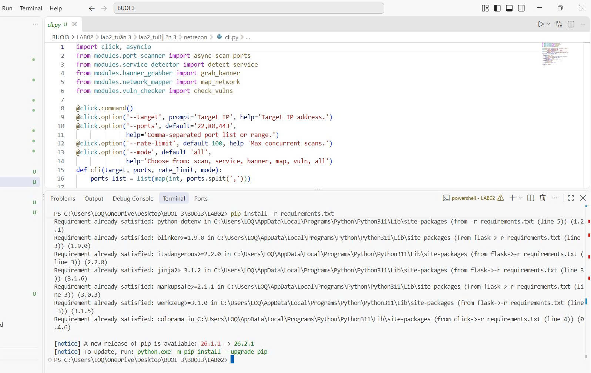
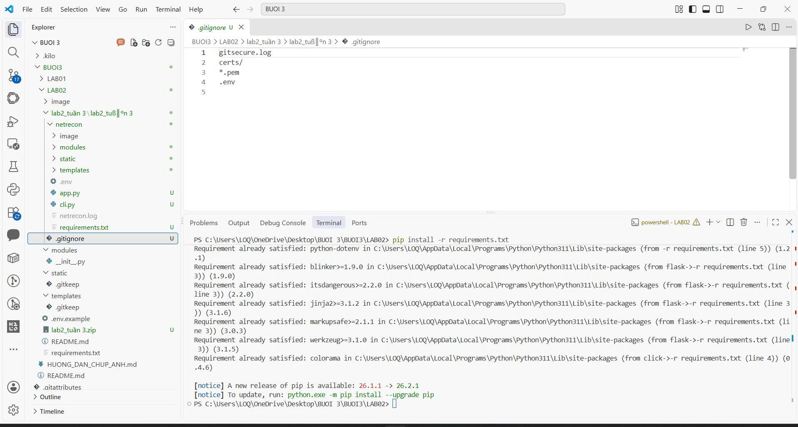
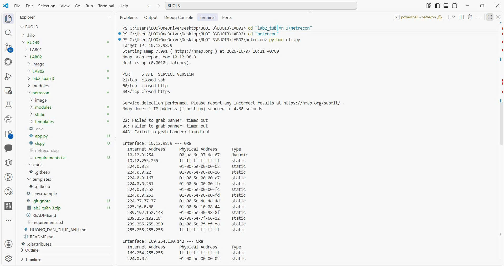
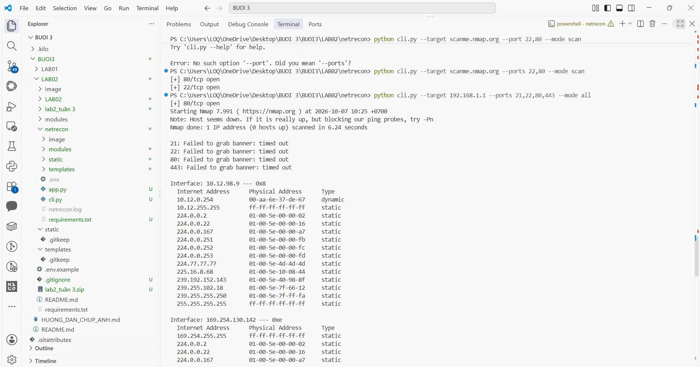

# Ảnh thực hành LAB02 - NetRecon

Thư mục lưu 10 ảnh gốc do sinh viên cung cấp, theo thứ tự thời gian trong tên file.
Các chú thích bên dưới được đối chiếu trực tiếp với ảnh và mã nguồn hiện tại.

**Gallery nhúng 8 ảnh.** Ảnh số 1 và 3 chưa nhúng do có thông tin phiên/mật khẩu chưa che.
Không nhúng không có nghĩa là file gốc đã được xóa khỏi Git; cần xử lý giá trị bí mật đã lộ và thay ảnh riêng.

Xem [hướng dẫn chạy và kết quả LAB02](../README.md).

## 1. Tạo mật khẩu ứng dụng cho NetRecon

Trang tài khoản Google ghi nhận mục ứng dụng Netrecom. Thanh địa chỉ còn chứa tham số xác thực phiên; không nhúng ảnh gốc này. Cần ảnh đã che thanh địa chỉ trước khi dùng công khai.

## 2. Kiểm tra phiên bản Nmap

Terminal chạy nmap --version và trả về Nmap 7.991. Editor mở requirements.txt và cây thư mục mã nguồn của lần thực hành.

## 3. Cấu hình email trong .env

Ảnh gốc hiển thị SMTP_PASS chưa che, nên không nhúng hoặc liên kết ảnh trong tài liệu. Cần thu hồi App Password đã lộ, tạo giá trị mới và thay bằng ảnh đã che; .gitignore không bảo vệ mật khẩu đã nằm trong ảnh.

## 4. Cài dependency và chuẩn bị CLI

Terminal có các dòng Requirement already satisfied khi cài requirements.txt. Editor thể hiện các tùy chọn --target, --ports, --rate-limit và --mode của cli.py.

## 5. Loại trừ cấu hình nhạy cảm khỏi Git

Editor mở .gitignore với .env, certs/ và các quy tắc trong ảnh; terminal ghi nhận dependency đã có. Quy tắc .env không tự loại trừ ảnh chụp nội dung file đó.

## 6. Chạy CLI với target nhập tương tác

Lệnh python cli.py hỏi Target IP. Kết quả cho 10.12.98.9: Nmap báo cổng 22/80/443 closed, lấy banner bị timeout và phần Network Map in bảng ARP.

## 7. Quét cổng bằng tùy chọn --ports

Ảnh có lịch sử gõ sai --port; lệnh dùng đúng --ports ở phía dưới trả về 80/tcp open và 22/tcp open. Bảng CVE phía trên là dữ liệu mẫu tra theo cổng, không phải lỗ hổng đã được kiểm chứng.

## 8. Chạy tổng hợp với --mode all

Với 192.168.1.1, bộ quét TCP in 80/tcp open; bước Nmap báo Host seems down, đọc banner timeout và bước map trả bảng ARP. Các quan sát này được giữ riêng theo từng công cụ.

## 9. Kết quả trên giao diện web

Trình duyệt mở localhost:5000/scan. Trang hiển thị Service Detection, Banner Grabbing và Network Map; cổng 22/80/443 closed và banner timeout trong lần quét mục tiêu lab.

## 10. Nhận email kết quả NetRecon

Gmail hiển thị thư có tiêu đề Kết quả quét từ NetRecon. Nội dung gồm SCAN: None, kết quả Nmap và các thông báo banner timeout, phù hợp với cách trả kết quả của code hiện tại.

## Các ảnh có thể bổ sung khi hoàn thiện báo cáo

- Terminal khởi động Flask tại cổng 5000.
- Form web trước khi Scan, với target/ports/mode/email đã nhập.
- Trạng thái commit/push và thư mục LAB02 trên GitHub.
- Bản chụp cấu hình email đã che toàn bộ bí mật.

Giữ đúng kết quả thực tế trong ảnh. Không sửa closed/timeout thành open hoặc mô tả bảng CVE mẫu là kết luận khai thác.
